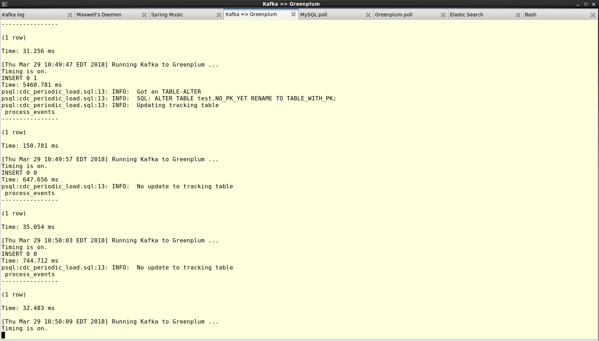

# Change Data Capture (CDC) from MySQL to Greenplum Database

## Abstract
When an Pivotal Cloud Foundry operator installs PCF, it’s very likely they will
choose to deploy the MySQL database tile (this is my personal observation).
With this in place, developers can easily self-provision a persistence layer
for their applications.  These are optimized for transactional workloads, but
not large data sets and analytical queries.  This is where Pivotal Greenplum
Database can be brought in, to provide that long-term, deep analytical query
back end.  This document introduces an approach to linking these two data
backends.



## Approach
* [Maxwell's Daemon](http://maxwells-daemon.io/) captures any DDL or DML operations in MySQL and publishes them to a Kafka topic.
* Apache Kafka provides the messaging layer.
* Greenplum Database external tables, combined with [this Kafka integration approach](https://github.com/mgoddard-pivotal/gpdb-kafka-round-trip) enables Greenplum to ingest these MySQL events.
* The events are published in JSON format and stored within Greenplum in their original format, so they can be replayed any time.
* 

## Demo Environment
Note: the library which must be installed is highlighted in **bold**.
<pre>
[root@gpdb ~]# cat /etc/redhat-release 
CentOS release 6.9 (Final)
[root@gpdb ~]# uname -a
Linux gpdb 2.6.32-696.el6.x86_64 #1 SMP Tue Mar 21 19:29:05 UTC 2017 x86_64 x86_64 x86_64 GNU/Linux
[root@gpdb ~]# ldd ~gpadmin/go-kafkacat 
	linux-vdso.so.1 =>  (0x00007ffc7cb2d000)
	<b>librdkafka.so.1 => /usr/local/lib/librdkafka.so.1 (0x00007fd06b1bf000)</b>
	libpthread.so.0 => /lib64/libpthread.so.0 (0x0000003b0d400000)
	libc.so.6 => /lib64/libc.so.6 (0x0000003b0cc00000)
	libsasl2.so.2 => /usr/lib64/libsasl2.so.2 (0x0000003b1e000000)
	libssl.so.10 => /usr/lib64/libssl.so.10 (0x0000003b1cc00000)
	libcrypto.so.10 => /usr/lib64/libcrypto.so.10 (0x0000003b19800000)
	libz.so.1 => /lib64/libz.so.1 (0x0000003b0dc00000)
	libdl.so.2 => /lib64/libdl.so.2 (0x0000003b0c800000)
	librt.so.1 => /lib64/librt.so.1 (0x0000003b0d800000)
	/lib64/ld-linux-x86-64.so.2 (0x0000003b0c400000)
	libresolv.so.2 => /lib64/libresolv.so.2 (0x0000003b0e800000)
	libcrypt.so.1 => /lib64/libcrypt.so.1 (0x0000003b18400000)
	libgssapi_krb5.so.2 => /lib64/libgssapi_krb5.so.2 (0x0000003b1c000000)
	libkrb5.so.3 => /lib64/libkrb5.so.3 (0x0000003b1a800000)
	libcom_err.so.2 => /lib64/libcom_err.so.2 (0x0000003b18c00000)
	libk5crypto.so.3 => /lib64/libk5crypto.so.3 (0x0000003b1b400000)
	libfreebl3.so => /lib64/libfreebl3.so (0x0000003b17000000)
	libkrb5support.so.0 => /lib64/libkrb5support.so.0 (0x0000003b1a400000)
	libkeyutils.so.1 => /lib64/libkeyutils.so.1 (0x0000003b19000000)
	libselinux.so.1 => /lib64/libselinux.so.1 (0x0000003b0e400000)
</pre>

## TODO
1. Add some scripts to handle periodic Greenplum maintenance
   * [Vacuum tables and catalog](https://gpdb.docs.pivotal.io/43170/admin_guide/managing/maintain.html)
2. Add another consumer group to "fan out" fan out to Elastic Search
   * Try just using a single index for all tables
   * Form the `doc_id` using the primary key values from the table?
   * Also index/store the DB name and the table name

## See Also
* [Canal](https://github.com/siddontang/go-mysql#canal), a Go lang binlog replicator

## Issues
```
10:30:07,078 INFO  BinlogConnectorLifecycleListener - Binlog connected.
10:30:07,129 WARN  BinlogConnectorLifecycleListener - Event deserialization failure.
com.github.shyiko.mysql.binlog.event.deserialization.EventDataDeserializationException: Failed to deserialize data of EventHeaderV4{timestamp=1522558072000, eventType=UPDATE_ROWS, serverId=1, headerLength=19, dataLength=89, nextPosition=48082965, flags=0}
	at com.github.shyiko.mysql.binlog.event.deserialization.EventDeserializer.deserializeEventData(EventDeserializer.java:216) ~[mysql-binlog-connector-java-0.13.0.jar:0.13.0]
	at com.github.shyiko.mysql.binlog.event.deserialization.EventDeserializer.nextEvent(EventDeserializer.java:184) ~[mysql-binlog-connector-java-0.13.0.jar:0.13.0]
	at com.github.shyiko.mysql.binlog.BinaryLogClient.listenForEventPackets(BinaryLogClient.java:890) [mysql-binlog-connector-java-0.13.0.jar:0.13.0]
	at com.github.shyiko.mysql.binlog.BinaryLogClient.connect(BinaryLogClient.java:559) [mysql-binlog-connector-java-0.13.0.jar:0.13.0]
	at com.github.shyiko.mysql.binlog.BinaryLogClient$7.run(BinaryLogClient.java:793) [mysql-binlog-connector-java-0.13.0.jar:0.13.0]
	at java.lang.Thread.run(Thread.java:748) [?:1.8.0_161]
Caused by: com.github.shyiko.mysql.binlog.event.deserialization.MissingTableMapEventException: No TableMapEventData has been found for table id:1116691496960. Usually that means that you have started reading binary log 'within the logical event group' (e.g. from WRITE_ROWS and not proceeding TABLE_MAP
	at com.github.shyiko.mysql.binlog.event.deserialization.AbstractRowsEventDataDeserializer.deserializeRow(AbstractRowsEventDataDeserializer.java:98) ~[mysql-binlog-connector-java-0.13.0.jar:0.13.0]
	at com.github.shyiko.mysql.binlog.event.deserialization.UpdateRowsEventDataDeserializer.deserializeRows(UpdateRowsEventDataDeserializer.java:71) ~[mysql-binlog-connector-java-0.13.0.jar:0.13.0]
	at com.github.shyiko.mysql.binlog.event.deserialization.UpdateRowsEventDataDeserializer.deserialize(UpdateRowsEventDataDeserializer.java:58) ~[mysql-binlog-connector-java-0.13.0.jar:0.13.0]
	at com.github.shyiko.mysql.binlog.event.deserialization.UpdateRowsEventDataDeserializer.deserialize(UpdateRowsEventDataDeserializer.java:33) ~[mysql-binlog-connector-java-0.13.0.jar:0.13.0]
	at com.github.shyiko.mysql.binlog.event.deserialization.EventDeserializer.deserializeEventData(EventDeserializer.java:210) ~[mysql-binlog-connector-java-0.13.0.jar:0.13.0]
	... 5 more
```
**Resolution:**
1. Stop Maxwell's Daemon
1. Run the following from the MySQL command prompt, logged in as the DB super-user:
    ```
    mysql> PURGE BINARY LOGS BEFORE '2018-04-02 10:36:33';
    mysql> DROP DATABASE maxwell;
    ```
1. Restart Maxwell's Daemon


